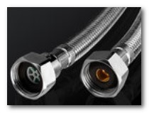

# Headline

> An awesome project.
修改  
# 标题3
换行

换行  
换行
没有数字

## 标题1

<table style="width: 471px;"><tbody><tr><td align="left" valign="middle" style="width:120px">saf&nbsp;</td><td align="left" valign="middle" style="width: 350px;">asdf&nbsp;</td></tr><tr><td align="left" valign="middle" style="width:120px">asfd&nbsp;</td><td align="left" valign="middle" style="width: 350px;" class="">asf&nbsp;</td></tr></tbody></table>

# 标题2
sdfsfsf 
sfs地方sfsaf 

是否萨芬

上3
23
32
2
## 32
3
2
3
## 标题33

<table style="width: 241px;"><tbody><tr><td align="left" valign="middle" style="width:120px"> </td><td align="left" valign="middle" style="width:120px"> </td></tr></tbody></table>

是否
舒服的
撒旦法

是否ss
是否  
是否撒旦法  
是否  
撒发顺丰  
撒发顺丰  
撒发顺丰  
撒发顺丰  
撒发顺丰  
撒发顺丰  
撒发顺丰  
撒发顺丰  
