<!DOCTYPE HTML><html><head>
<meta http-equiv="Content-Type" content="text/html; charset=utf-8">

<title>泡沫机DIY制作（含洗洁精比例消耗记录）</title>
    
</head>

<body class="wiz-editor-body " data-wiz-document-type="common" spellcheck="false"  style="opacity: 1;">
更新于：[2023-03-19]
<h1>配件清单：</h1>

<table style="width: 638px;"><tbody><tr><td style="width: 110px;">名称</td><td style="width: 103px;">规格，数量</td><td style="width: 424px;">价格、备注</td></tr><tr><td align="left" valign="middle" style="width: 110px;">泡沫泵 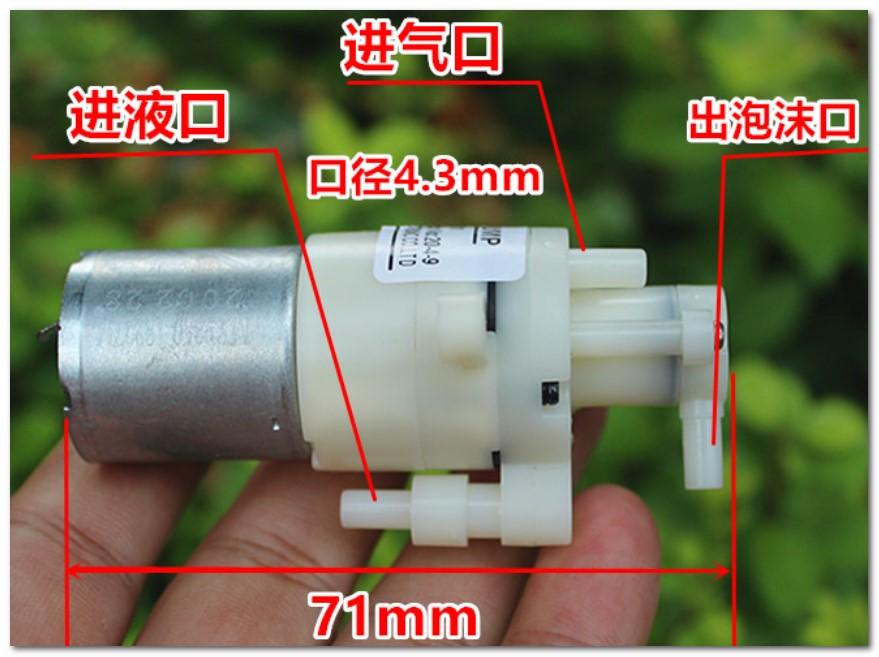 </td><td style="width: 103px;">1个</td><td style="width: 424px;">5元/个【建议买两个备用，泡沫泵属于半消耗品】 【蓝色标记点为正极】 https://item.taobao.com/item.htm?id=671622240797 【遇坑经验：固定耳厚度约4.6mm。使用M3+6mm尼龙柱无法通过安装孔来头尾对接耦合，虽固定耳有内陷孔但M3尼龙柱直径比内陷孔直径要粗无法嵌入】</td></tr><tr><td style="width: 110px;">气泡石 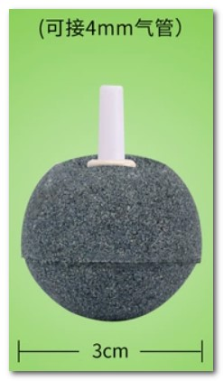</td><td style="width: 103px;">
3cm，1个 
</td><td style="width: 424px;">2元/个【用途：过滤液体杂质，延长泡沫泵寿命】 https://item.taobao.com/item.htm?id=669294998249 </td></tr><tr><td style="width: 110px;">
尼龙柱

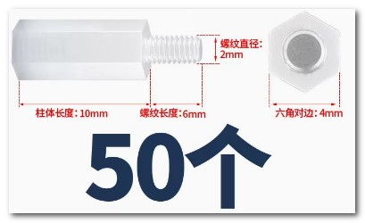

</td><td style="width: 103px;">m2x10+6，50个</td><td style="width: 424px;">7元/50个 https://detail.tmall.com/item.htm?id=17551140559  </td></tr><tr><td style="width: 110px;">透明罐 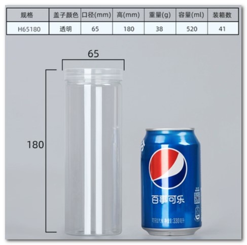</td><td style="width: 103px;">6.5x18cm，1个</td><td style="width: 424px;">11元/10个 https://item.taobao.com/item.htm?id=631213295046</td></tr><tr><td style="width: 110px;">分装瓶 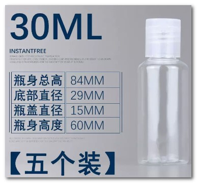</td><td style="width: 103px;">
直径29mm

1个
</td><td style="width: 424px;">6元/5个 https://detail.tmall.com/item.htm?id=654325223428</td></tr><tr><td align="left" valign="middle" style="width: 110px;">透明硅胶管 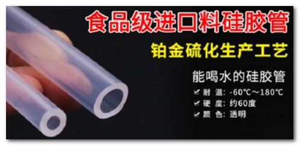</td><td align="left" valign="middle" style="width: 103px;">1x2，1米 2x4，1米 4x6，1米</td><td align="left" valign="middle" style="width: 424px;">2元/米，2元/米，3元/米 https://item.taobao.com/item.htm?id=671326524155  </td></tr><tr><td style="width: 110px;">
硅橡胶705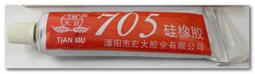
</td><td style="width: 103px;">1支</td><td style="width: 424px;">3元/支 【用途：分装瓶与罐盖的粘合】 https://item.taobao.com/item.htm?id=581580926356</td></tr><tr style="height: 133px;"><td style="width: 110px;">PH2.0延长线 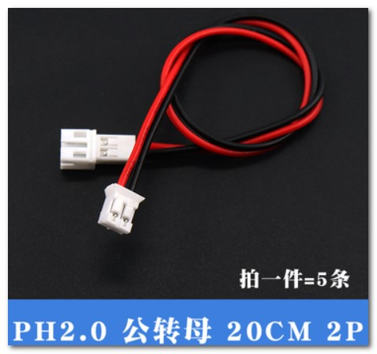</td><td style="width: 103px;">2P-20CM， 3条</td><td style="width: 424px;">
5元/5条

【PH2.0公对母延长线，单条最长20cm，若对接40cm无法临时拿出来测试，因此需要3条】

https://item.taobao.com/item.htm?id=657855052430
</td></tr><tr><td style="width: 110px;">刻度尺贴纸 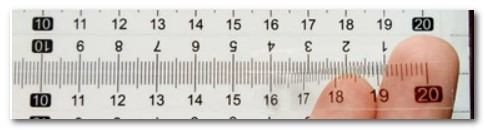</td><td style="width: 103px;">
长20cm 

2条
</td><td style="width: 424px;">16元/8条【便于观察记录液体剩余量】 https://item.taobao.com/item.htm?id=545095808373</td></tr><tr><td style="width: 110px;">其他工具</td><td style="width: 103px;"> </td><td style="width: 424px;">2mm钻头一支；</td></tr></tbody></table>

 
<h1>制作教程：</h1>
过于简单，一看就懂：

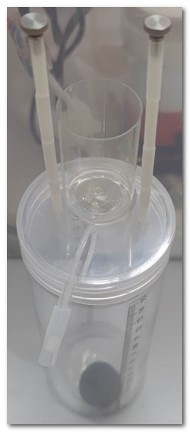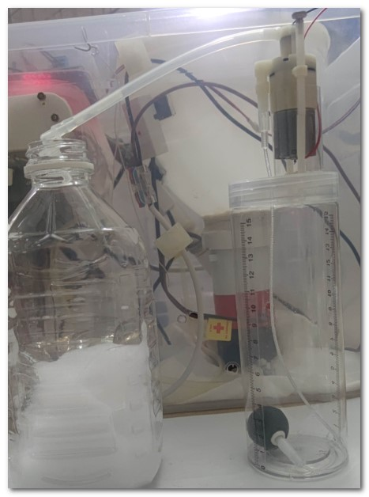

软管的嵌套：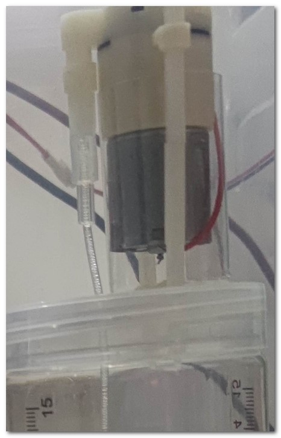

 

 

 
<h1>经验说明：</h1><h2>&nbsp; &nbsp; 过滤器：</h2>
&nbsp; &nbsp; 注意：洗洁精混合液里中有无法自然水融化的胶质、絮状杂质（阳光照射可观测到），可能会粘附堵住发泡网。 

&nbsp; &nbsp;&nbsp;发泡泵如果没用【过滤器】来过滤进水，极为易损：因出水口是微米细密网格，若水中有杂质、胶质、堵住网格和隔膜——就会减少发泡量，甚至不起泡沫。 

&nbsp; &nbsp;&nbsp;&nbsp; &nbsp; 过滤器可使用3cm或更小的气泡石，因只是过滤使用对体积没要求，越小越好，超过3cm对瓶子内部来说太占空间——PS：圆形气泡石虽然3cm直径高度，但有极强的亲水性，可以把水位线抽空至0.1cm的高度：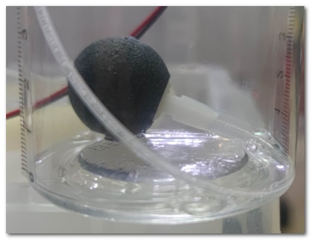

 

<h2>&nbsp; &nbsp;&nbsp;310马达固定方案2个：</h2>
<ol class="wiz-list-level1"><li><b>小分装瓶</b></li><ol class="wiz-list-level2"><li>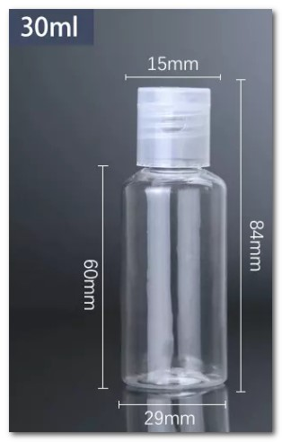外径29mm（内径28~28.5mm），很修身不影响固定耳上下直通。可以塞入泵体和电线，泵体部分塑料圆柱直径27mm（不包含挂耳）。</li><li>问题：若只放入下半310马达部分的话，四周有很大空隙会轻易晃动（相比于2方案）。</li></ol><li><b>矿泉水瓶瓶口</b></li><ol class="wiz-list-level2"><li>内径25mm，正好可以放入24.4mm外径的310马达。</li><li>百岁山矿泉水是直角肩膀，胶水接触面积大。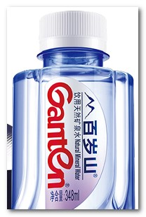</li><li>问题：有螺纹且挡圈会干扰到进水管、固定耳的上下直通、内径过于合身导致电线难以塞入，可以通过切割豁口解决：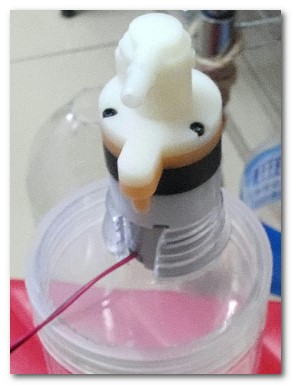</li></ol></ol>

 

<h1>洗洁精比例、消耗记录：</h1>

<table style="width: 632px;"><tbody><tr style="height: 68px;"><td align="left" valign="middle" style="width: 631px;">
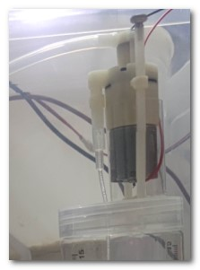
</td></tr><tr><td align="left" valign="middle" style="width: 631px;">发泡泵电压：洗洁精比例：</td></tr></tbody></table>

 

<table style="width: 650px;"><tbody><tr><td style="width: 649px;">
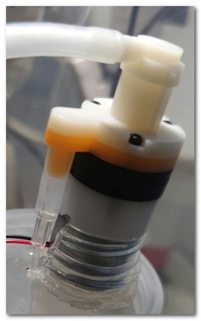
</td></tr><tr><td align="left" valign="middle" style="width: 649px;">[23-03-09] 洗洁液天数预估： 发泡泵电压=3.2v；洗洁精：比例1/4；
[23-03-09] 容器：容器6.5cm直径x18厘米高度=水容量530ml。 发泡泵继电器设置3秒=9次/1厘米。保守8次计算，15厘米×8次=120次÷每日4次=30天 发泡泵继电器设置2秒=14次/1厘米。保守13次计算，15厘米×13次=195次÷每日4次=48天
[23-03-09] 容器：刻度瓶500ml 继电器设置2秒=10次/20ml。500ml÷20ml×10次=250次÷每日4次=62天。 <blockquote style="">保守9次计算，500ml÷20ml×9次=225次÷每日4次=56天。</blockquote></td></tr></tbody></table>

 

 

 
</body></html>