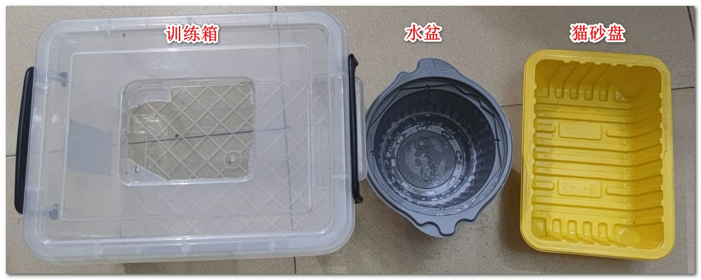
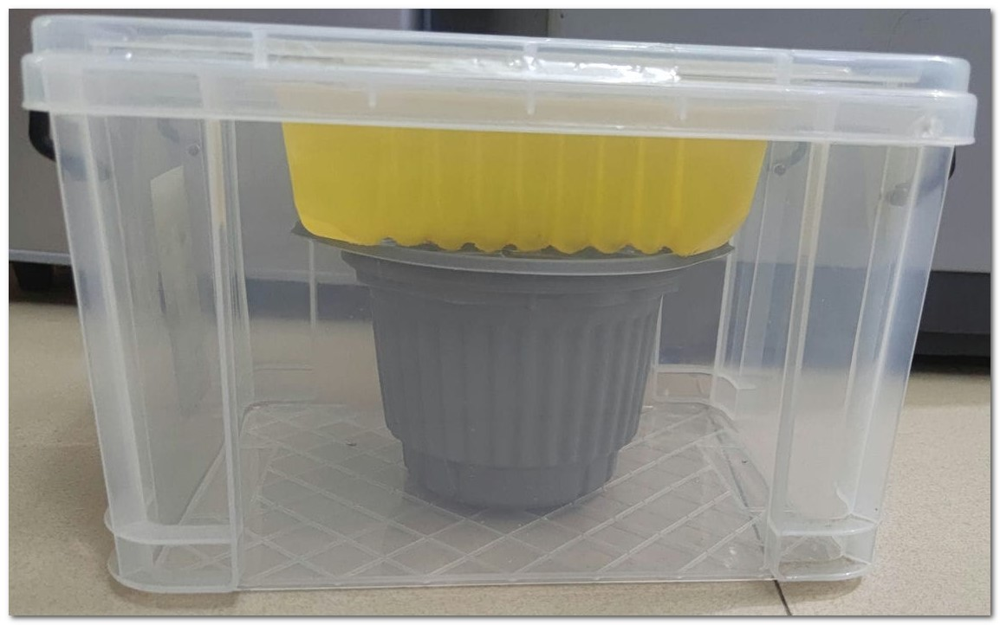
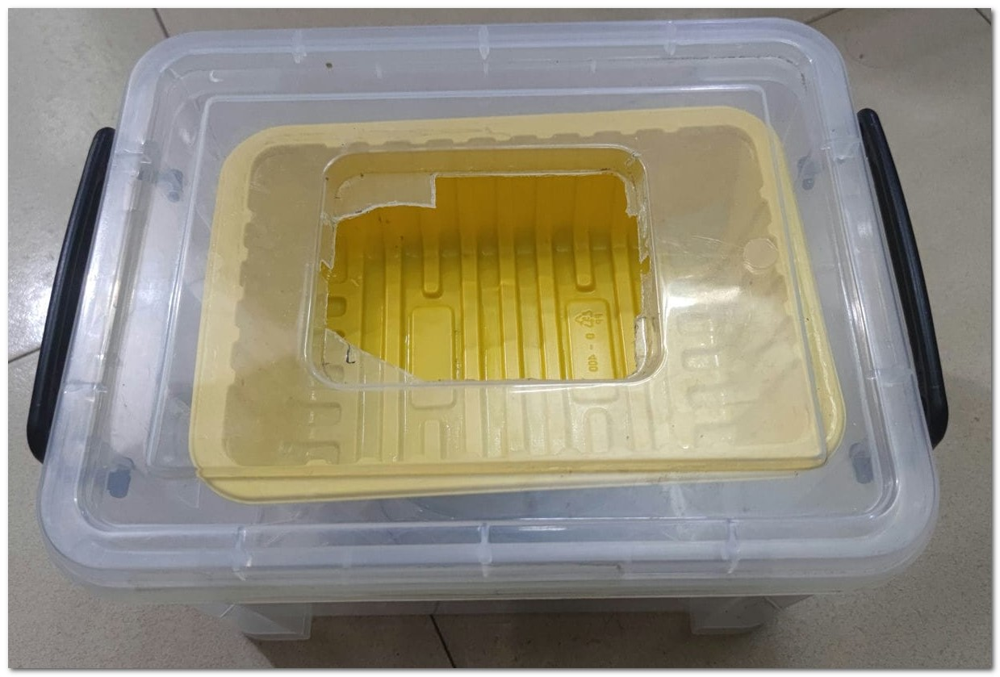
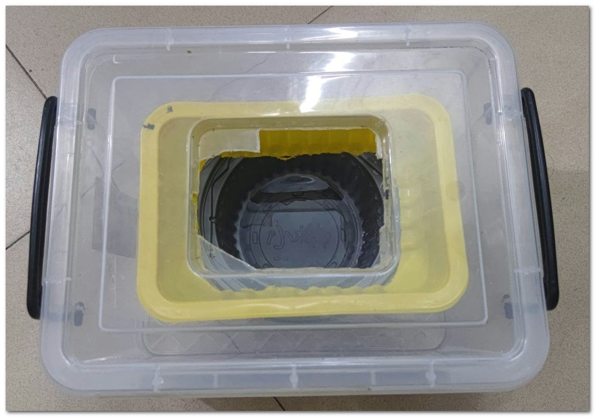

# 训练
# 从训练箱开始
务必！务必！务必！先使用训练箱手动倒水1~2月，无砂习性彻底固化后，再制作【自冲水猫马桶】。
原因：
* 花大功夫先制作完自冲水猫马桶，最后训练使用失败，白费数月功夫。
* 且先制作好正式的自冲水猫马桶，那么此时训练就需要让猫100%适应你的预设计，容错率很低，最终训练难度和耗费时间陡增。   

因此：先使用训练箱1~2月，手动倒水，中途根据猫的站姿调整设计开孔和限位方案，待猫习性固化后，根据最终成功的姿态设计制作，再制作自动化冲水部分。  

到2~3周训练器猫砂盘的开孔就已经足够大，猫会拉进底部水盆，就基本没臭味。（倒水盆的时候有）

# 训练箱构造图

* 材料：收纳箱、水盆（自热米饭锅）、猫砂盘（一次性生鲜盘子）
    *  
* 侧视图：
    * 
* 猫砂盘第一天：
    * 
* 猫砂盘底部开孔最后一天：
    * 

# 猫砂盘扩孔注意事项
猫砂盘的扩孔速度要慢，这点非常重要！至少扩孔15圈次（因此每圈不要扩太大！），每次扩孔前要至少满足两个条件：每48小时且两次大便后扩大一圈（既最少需时30天），实际时间以满足最久那一个条件为准：
1. 若大便拉的频繁那么两次时间加起来都不到48小时则等满48小时后再扩大一圈。
2. 若48小时内未有两次排便则等两次排便后再扩大一圈。

年龄大的猫：若48小时且两次排便的扩孔间隔，对你家猫来说还是太快不能接受的话，则加长时间条件。

