# 进阶：自冲水猫马桶制作教程
---
# 封闭环境·训练笼参考
* 训练期一个封闭环境是必须的【成败关键】。网友经验不封闭的训练猫，失败率百分百，因放养状态下猫的可选场所太多，例如比猫砂更爱的床被、沙发、墙脚等，开放环境下猫咪无法培养对新形态猫厕的强认知，所以必须封闭训练。
* 猫身子较长，笼子需要有充足的长度，否则空间不足猫蹲的时候，头会碰到前方铁网，就会歪身子。
    * 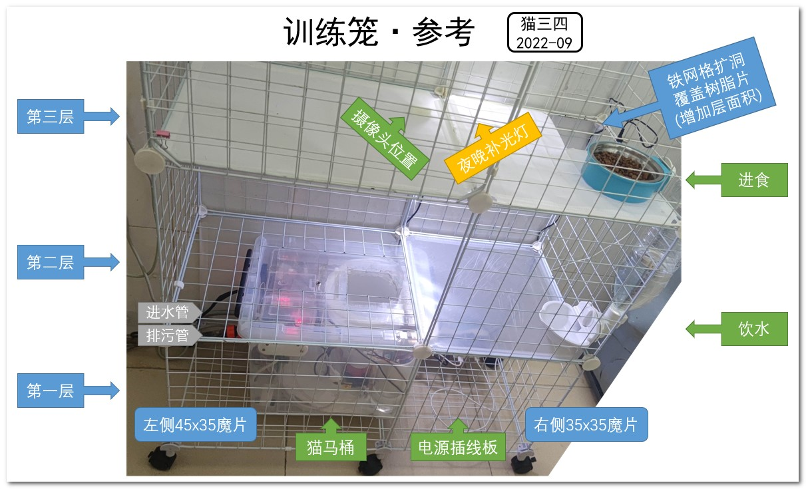

# 猫马桶外形概览
 * 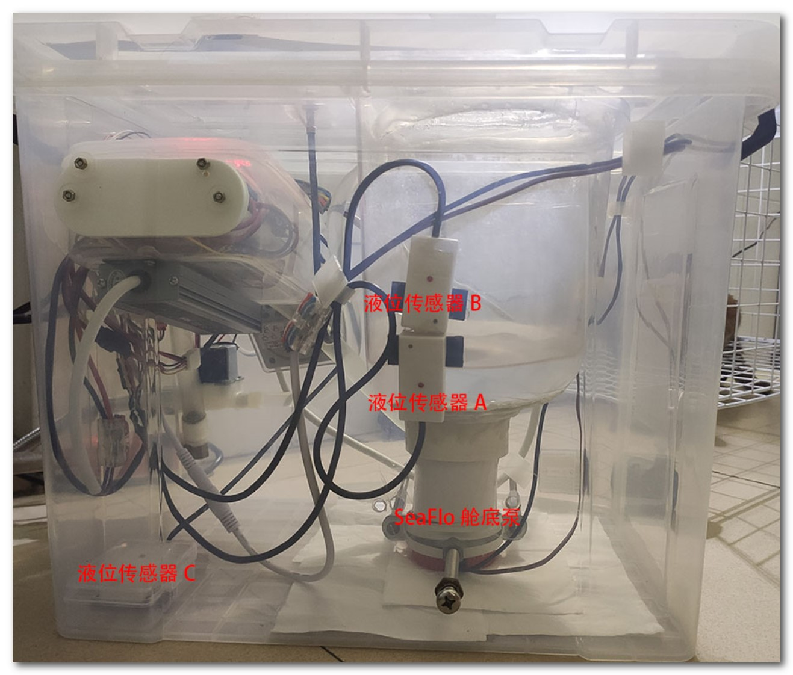 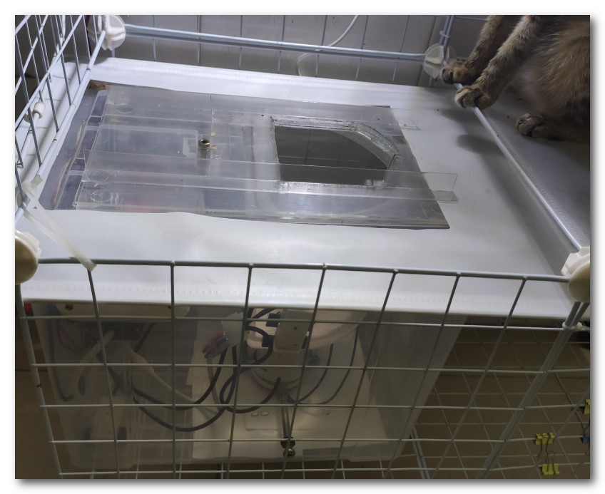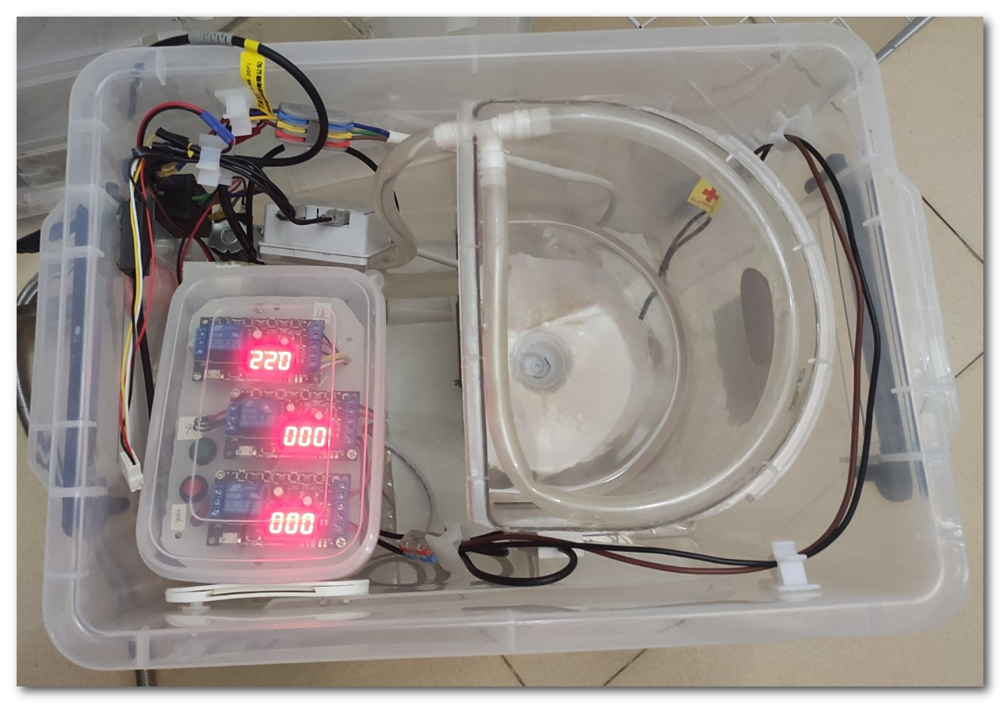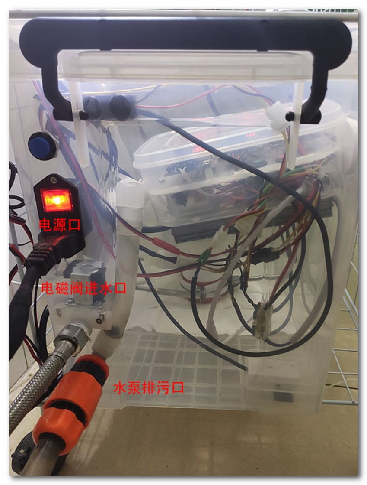

---
# 排污系统：便池与排污
## 便池：漏斗与水泵的组合
* 

## 存水弯+ 排水结构

* 方案一、G750舱底泵排水口径是19mm，可使用相近规格的宝塔(18mm)等径弯头：
    * 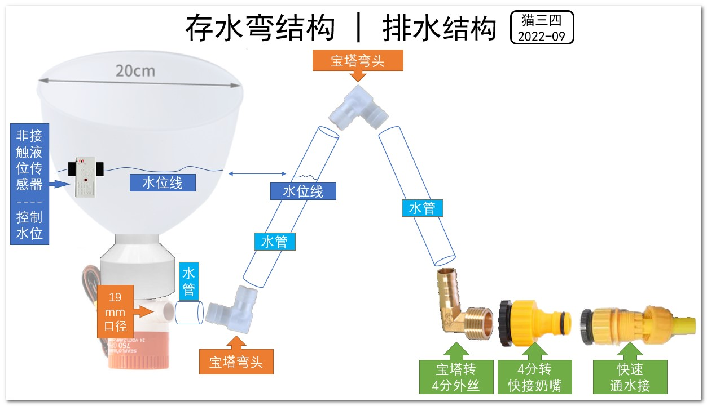

* 方案二、G1100舱底泵排水口径是29mm，可使用PVC(32mm)转宝塔变径弯头：
    * 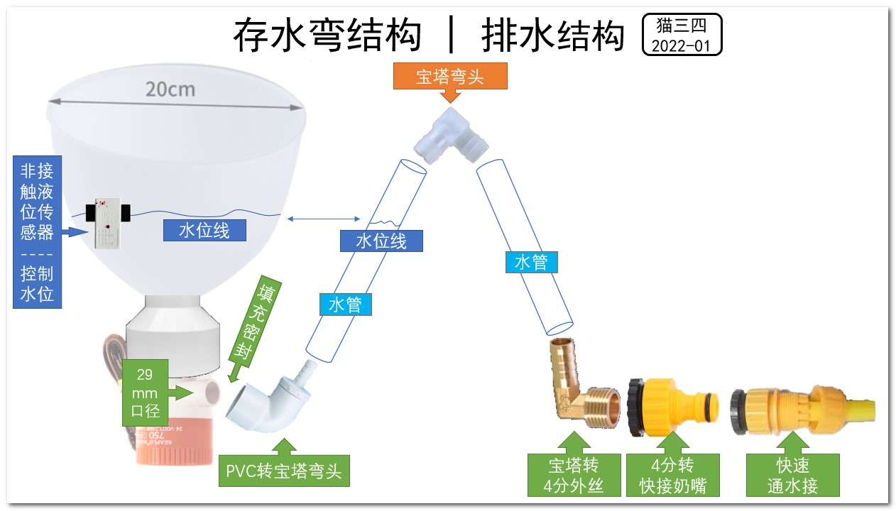

* 存在两个设计方案是因为此处有个最优选的存疑点：不同排量G750(19mm)和G1100(29mm)的舱底泵，若最终都是使用内径12毫米的五米长排污管，此时水泵的吸力是否一致？
    * 若G750和G1100吸力一致或者差距很小，则选用小口径的G750，做存水弯可使用等径宝塔弯头，对接较为方便。
    * 若G1100吸力明显更大则选用更大吸力的G1100，此方案做存水弯使用到PVC变径转宝塔，比G750方案需要额外的填充密封处理，较为麻烦。
    * 询问客服此问题得到模糊回答：【使用相同排水管，也是G1100排量大一些】（2022-09-27）。但不知这“大一些”是什么程度“大一些”。

---
# 清洁系统
## 清洁：【进水系统、冲洗系统】
* 主要部件：进水电磁阀、液位传感器、Y型宝塔三通、冲洗管：
    * 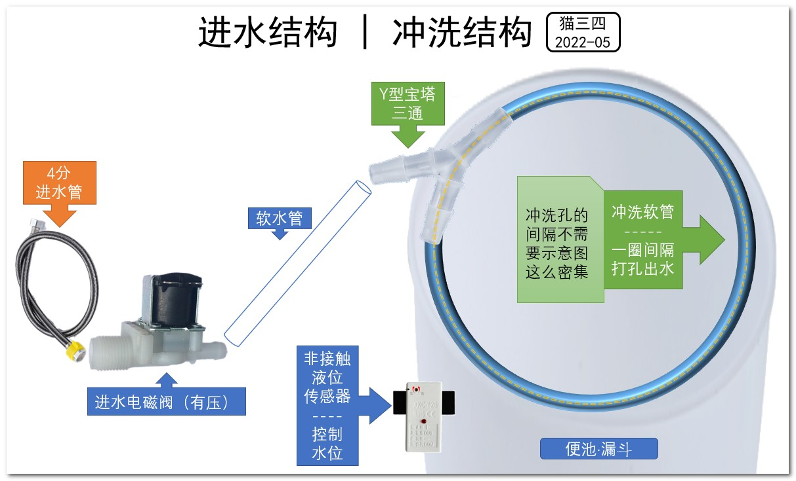

* 【冲洗管——实物图】: 
    * 

## 清洁：【泡沫泵(影响观测,实验性质)】
* 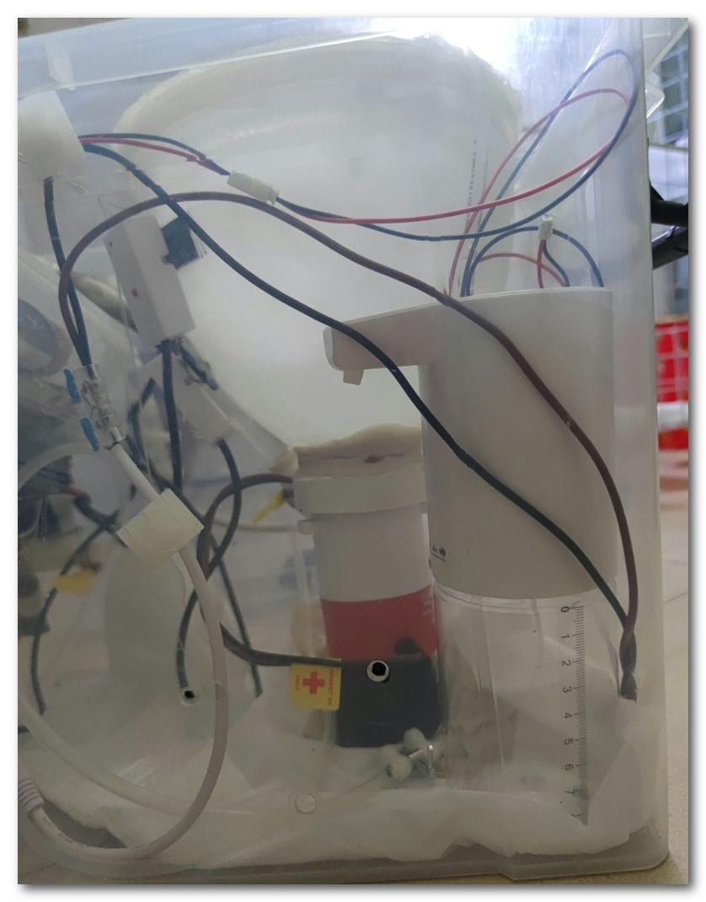 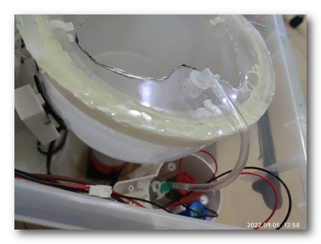 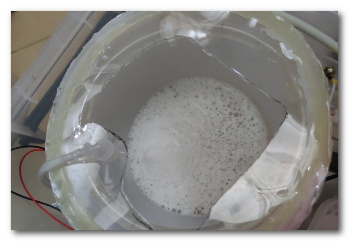

---
# 自动化电控系统
* 水泵每次工作时间以出现异响为止，出现异响说明水泵进入大量空气，已经无吸力，此时运转再久也无效率。正确的做法是“少时多次”，例如安装在地漏附近排水管很短，则水泵工作5秒-停转-等待补水10秒-水泵再次工作5秒，如此循环多次，来达到清洁效果，而不是水泵一次性工作几十秒，那只有无用功的大噪音。若是附近无地漏需要使用五米甚至十米的延长排污管，则延长水泵工作时间。
## 电控接线·最简系统（手动触发）
* 手动按压开关触发冲水
    * 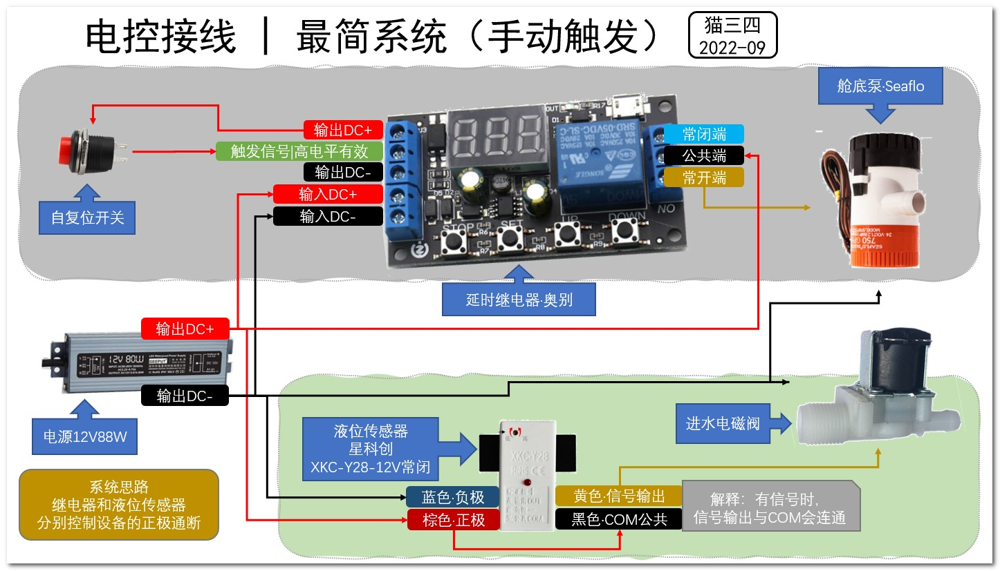

## 电控接线·全自动系统（感应触发）
* 全自动感应触发控制冲水
     * 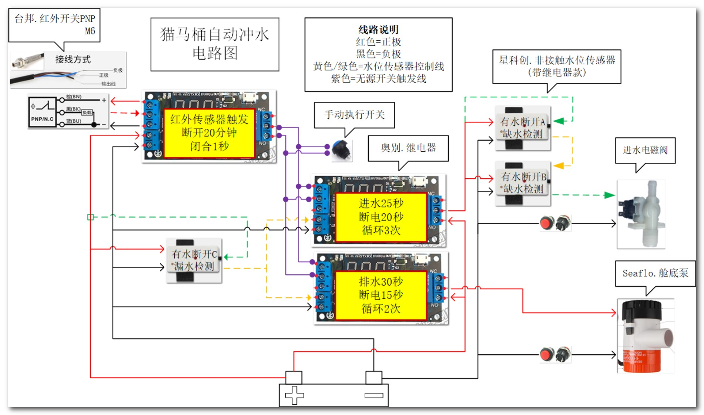

## 电控：红外传感器
* 安装位置：
    * 盖子-水洞前-从下往上感应：缺点是若是正好乱尿在这个位置则可能损坏传感器、尿液经过孔缝隙进入箱内。优点是一体化方便移动，且直款的最低有直径3mm的产品选择：
        * 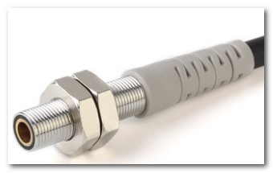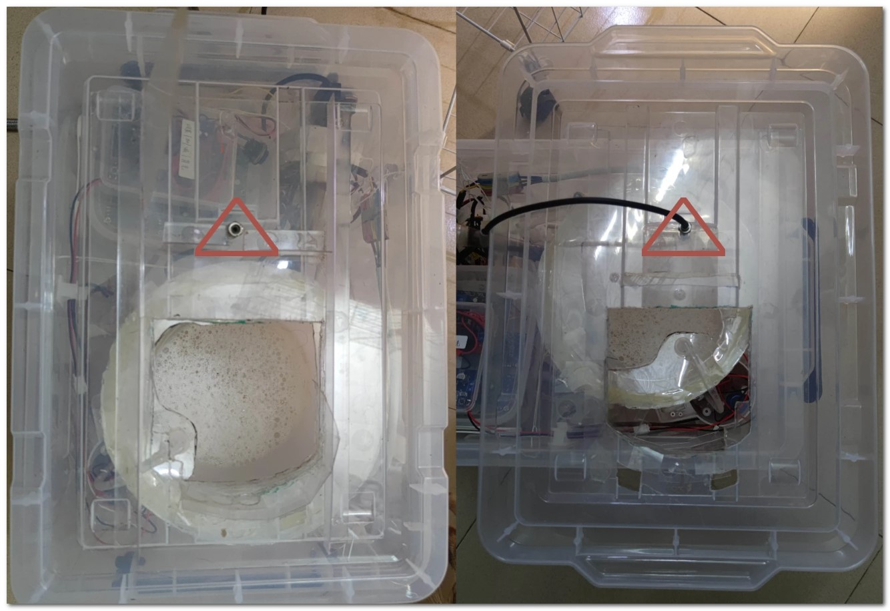
    
    * 盖上-边缘位置，从前往后感应：优点是在角落，保持盖子中间部分无孔整洁；缺点是弯头的直径很粗目前只搜到18mm的产品：
        * 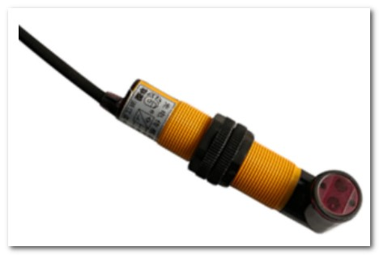
## 电控：非接触液位传感器
* 传感器选用【星科创 XKC-Y28-12V 常闭】的型号，内置2A继电器可直接控制进水电磁阀：
    * 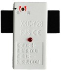
* 【常开】的意思：无信号时，输出端断开无电；有信号时，输出端闭合有电（不适用此方案）。
* 【常闭】的意思：无信号时，输出端闭合有电；有信号时，输出端断开无电：
    * 无水信号时→液位传感器内部闭合→进水电磁阀通电→进水
    * 有水信号时→液位传感器内部断开→进水电磁阀断电→停止进水
## 电控：延时继电器
## 电控：射频遥控器

